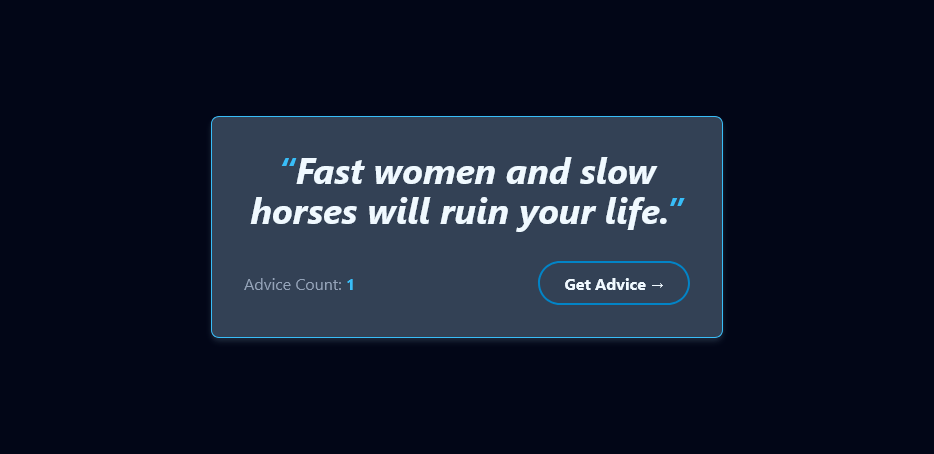

# React advice generator

## Description

This is a react app that generates a random advice using the [adviceslip api](https://api.adviceslip.com/). This is my first react project in my journey learning react. In this project, I learned some of the react fundamentals, such as:

- Data fetching
- useState and useEffect hooks
- Components and props

## Technologies

For this project, I used the following technologies:

- [React js](https://react.dev/)
- [Tailwind CSS](https://tailwindcss.com/)

## Setup

To run this project, follow these steps:

1. Clone this project

2. `npm install` to install the dependencies and node_modules.

3. `npm run start` to start the application.

You can check out the final result of this project [here](https://react-get-advice.vercel.app/).
